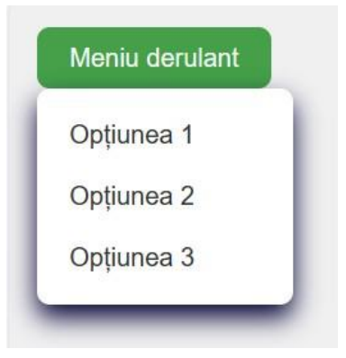
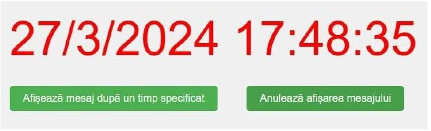
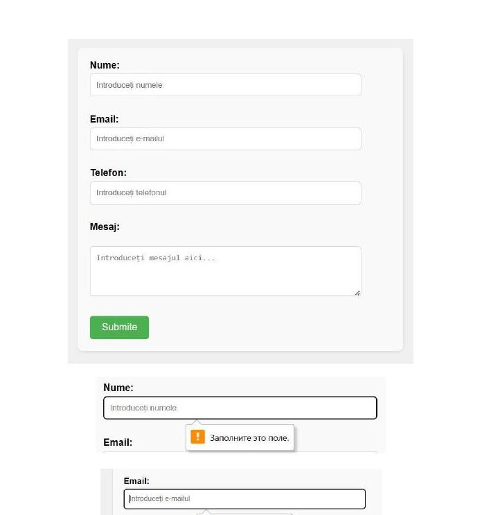
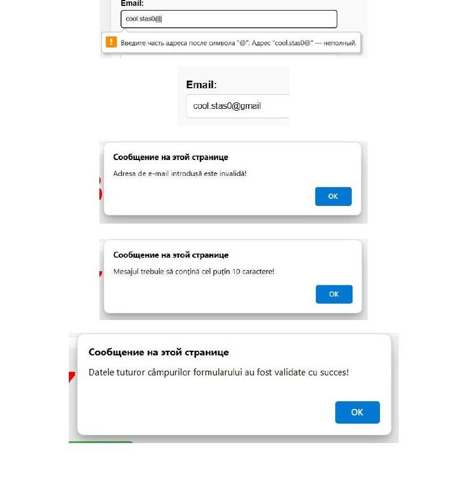

# Lucrare de Laborator Nr. 3 — Tehnologii Web

**Tema:** Crearea elementelor dinamice JavaScript și verificarea formularelor  
**Student:** Ciobanu Stanislav, gr. CR-221fr  
**Profesor:** lect. univ. Rusu Viorel  
**An:** 2024 | Facultatea Calculatoare, Informatică și Microelectronică, UTM

---

## 📋 Descriere

Introducere practică în JavaScript client-side: manipularea DOM-ului, gestionarea evenimentelor și validarea formularelor. Proiectul conține o pagină HTML cu mai multe funcționalități interactive implementate exclusiv în JS și CSS, fără biblioteci externe.

---

## 🗂️ Structura proiectului

```
exemplu_JS/
├── index.html   # Pagina principală cu codul JS inline
└── style.css    # Stilurile CSS pentru toate componentele
```

---

## ✨ Funcționalități implementate

### 1. Meniu derulant (Dropdown)
Buton cu handler `onClick` ce apelează `toggleDropdown()` — afișează/ascunde meniul. Stilizare cu hover și tranziții CSS.



---

### 2. Imagini defilante
Secțiune cu scroll orizontal (`overflow-x: auto`) ce afișează 3 imagini încărcate via CDN, cu lățime fixă de 300px fiecare.

---

### 3. Ceas în timp real
Obiect `Date` actualizat la fiecare secundă prin `setInterval(displayTime, 1000)`.  
- Text **albastru** dimineața (`hours < 12`)  
- Text **roșu** după-amiaza



---

### 4. Mesaj cu întârziere (`setTimeout` / `clearTimeout`)
- `delayMessage()` — solicită un interval (secunde) prin `prompt()`, validează input-ul cu `parseInt` și `isNaN`, apoi apelează `setTimeout`.  
- `cancelMessage()` — anulează timeout-ul activ prin `clearTimeout` după confirmare.


---

### 5. Validarea formularului (`onSubmit`)
Funcția `validareFormular()` verifică câmpurile înainte de trimitere și returnează `true`/`false`:

| Câmp | Regulă de validare |
|---|---|
| Nume | Doar litere și spații (regex `/^[a-zA-Z]+...$/`) |
| Email | Format valid cu `@` și domeniu (regex) |
| Telefon | Exact 9 cifre (regex `/^\d{9}$/`) |
| Mesaj | Minim 10 caractere |





---

## 🛠️ Tehnologii utilizate

- **HTML5** — structura paginii, atribute `required` și `pattern`
- **CSS3** — stilizare, tranziții, hover, `overflow-x`
- **JavaScript (ES5)** — DOM API, events, `setTimeout`, `setInterval`, `clearTimeout`, RegEx

---

## 🚀 Rulare

Nu este nevoie de server sau dependențe. Deschide direct în browser:

```bash
# Clonează repo-ul
git clone <url-repo>

# Deschide pagina
open exemplu_JS/index.html
```

> **Notă:** Imaginile sunt încărcate din CDN extern — este necesară conexiune la internet pentru afișarea lor.
